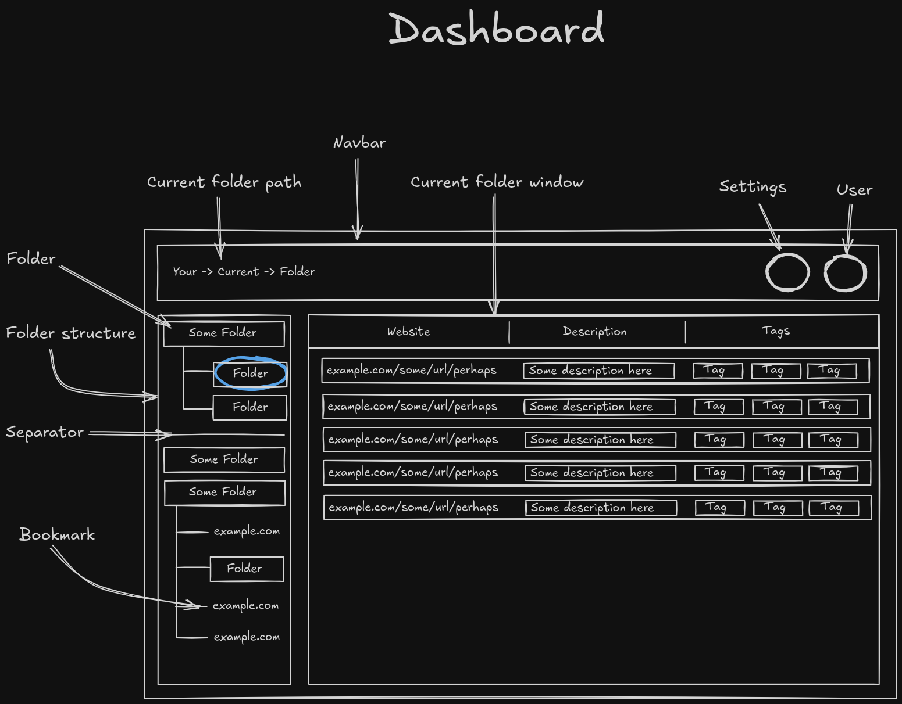
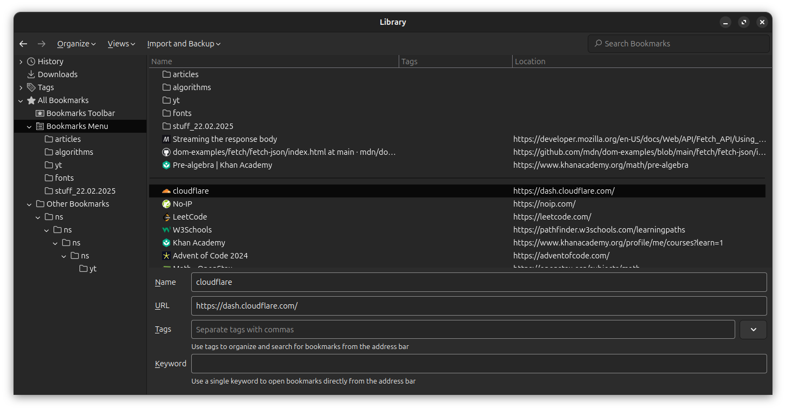

# Bookies
*A place to keep all your bookmarks for those of us with multiple browsers.*

I decided to make Bookies the day Mozilla had their ["Don't be evil"](https://en.wikipedia.org/wiki/Don%27t_be_evil) [moment](https://thehackernews.com/2025/03/mozilla-updates-firefox-terms-again.html),
and was looking for a new browser (as of 10.03.2024, I have still _NOT_ found a worthy successor...).

The way Firefox handles bookmarks is too good to let go...

**I simply _prefer_ the way Firefox handles bookmarks different from other browsers.**

So, here I am, trying the best to my abilities in replicating their implementation of "Bookmarks Library":

---
# MVP Features -
*that are currently being worked on.*

- [ ] 0. **SELF HOSTED WITH DOCKER CONTAINER.**
- [x] 1. Bookmarks and folders, implemented as individual *items*.
- [x] 2. Tree-structure for folders and bookmarks hierarchy, like a file-browser.
  - [x] 2.1 Ability to click a folder, showing the nested folders and bookmarks.
    - [x] 2.1.1 Arrow / icon to represent if the folder is closed or open.

- [ ] 3. Drag-and drop to sort each item in the tree. This will update in the Bookies (4) file.
- [ ] 4. The "Bookies.json" file, formatted for the entire tree-structure.
  - [ ] 4.1 Ability to extract the Bookies.json file.
    - [ ] 4.1.1 Ability to edit the Bookies.json file directly to update the tree-structure.

- [ ] 5. Ability to drag-and-drop URLs into Bookies to add bookmark.
  - [ ] 5.1 Prompt to add / edit: Title, URL, Tags.
    - [ ] 5.1.1 Fall-back to defaults if the prompt is skipped.

- [ ] 6. Folder-tree separator, to separate the items in the tree.
- [ ] 7. The "Main" browser view that views the data of the items in the selected folder, falls back to the root of the hierarchy.
- [ ] 8. The "Edit Bookmark" window to edit selected item.

---
# Features -
that will be included once the MVP is done.*

- [ ] 1. Create and add multiple users, either for different people, or different collection of bookmarks.
- [ ] 2. Password-protected bookmarks and folders.
- [ ] 3. Hidden _and_ Password-protected bookmarks and folders.
- [ ] 4. Toggle ability to keep folders permanently open, showing internal items. Parents can close, but wont affect toggled folders once reopening the parent.
- [ ] 5. Bookmarks-tree "grabbable" sliding width-adjustment.
- [ ] 6. Selection of color themes.

---
# Features -
*for the far future.*

- [ ] 1. Extension for popular browsers to add Bookies as a default bookmarks manager replacement. Simply login to the extension and have access to your bookmarks across all _supported_ browsers.

---
# My Notes During development
### 2025.03.10
[22:28] Make some damn script to populate and randomize the Bookies.json file for demonstration and testing.
[22.47] Was thinking "The Bookies.json file does not need ID's to identify bookmarks and folders, so maybe apply the ID's when parsing the file, then remove them again when the user exports the file.", but then considered that ID's can be used to identify the order of which the bookmark / folder was added to the collection. Great for "sort by last added" feature.
[22.51] Some way to go about "selected folder showing the bookmarks in main browser view" and "selected bookmark showing the editing window for that bookmark": \
- When clicking on a folder, place the ID and meta-data in localstorage for a component watcher to update the main browser view. \
- Same for bookmarks, but with the editing window.
**OR**
- Similar technique, but instead of localstorage, use a Vue databank for global data storage (Pinia or some other tech?).
